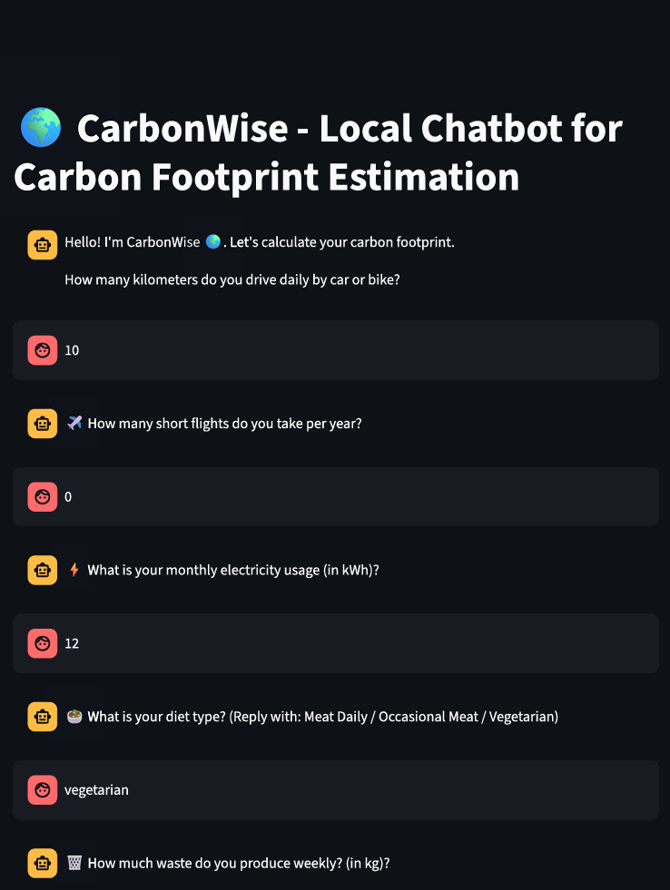
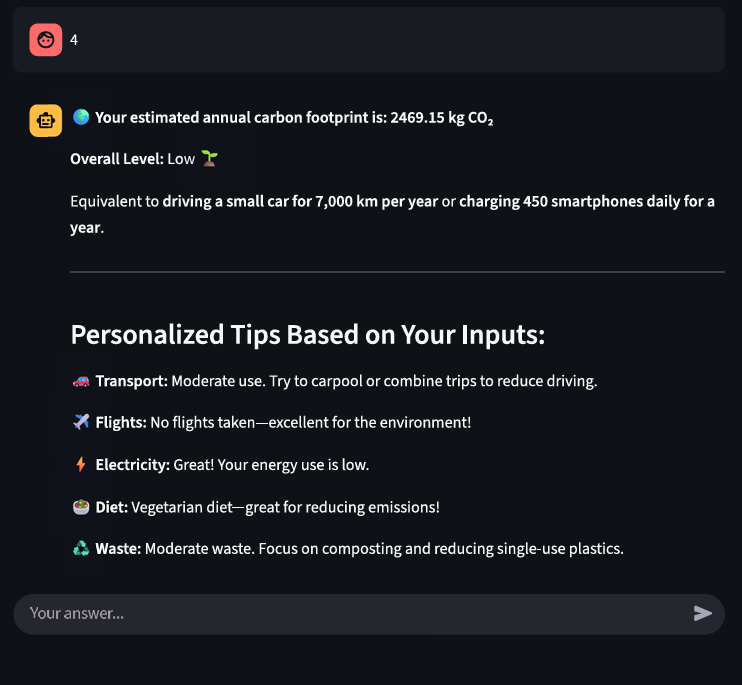

# CarbonWise - Local Chatbot for Carbon Footprint Estimation

🌍 **CarbonWise** is an interactive Streamlit chatbot that helps you estimate your annual carbon footprint based on your daily habits and lifestyle choices. The app provides a conversational interface and personalized tips to help you reduce your environmental impact.

## Features

- Conversational chatbot interface using Streamlit
- Calculates carbon emissions from:
  - Daily vehicle usage (car/bike)
  - Number of short flights per year
  - Monthly electricity consumption
  - Diet type (Meat Daily, Occasional Meat, Vegetarian)
  - Weekly waste generation
- Provides an overall carbon footprint estimate and level (Low, Medium, High, Very High)
- Personalized tips for each category to help you lower your footprint

## How to Run

1. **Install dependencies**  
   Make sure you have Python installed. Then, install Streamlit:

   ```sh
   pip install streamlit
   ```

2. **Run the app**  
   In your terminal, navigate to the project directory and run:

   ```sh
   streamlit run app.py
   ```

3. **Open in browser**  
   After running the command, a new tab will open in your default web browser with the chatbot interface.

4. **Interact with the chatbot**  
   Answer the questions in the chat interface to get your carbon footprint estimate and tips.

## File Structure

- [`app.py`](app.py): Main Streamlit application file.

## Example




## License

This project is for educational purposes.

## 👨‍💻 Author

- Sohang Chaudhari
- GitHub: [@sohangchaudhari133](https://github.com/sohangchaudhari133)
